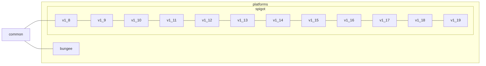

# Contributing

## プロジェクト構造

### [api](api)

APIの実装をしている。依存関係は以下の通り:



### [showcase](showcase)

例としてソースコードを埋め込むために使っている。

### [spigot-mock](spigot-mock)

ユニットテストを行なっている。[MockBukkit](https://github.com/MockBukkit/MockBukkit) と似ている。

#### テスト対象
- `api/*`
- `showcase`

### [spigot-test](spigot-test)

プラグインとしてフューチャーテストを行なっている。

#### テスト対象
- `api/*`

## Gradle タスク

### ビルド

```shell
./gradlew build

gradlew.bat build
```

全てのプロジェクトをビルドします。

### テスト

```shell
./gradlew test

gradlew.bat test
```

テストコードの確認をします。

### コードのフォーマット

```shell
./gradlew formatKotlin

gradlew.bat formatKotlin
```

ソースコードを整形します。コミットをする前に確認してください。

### 依存関係の更新確認

```shell
./gradlew dependencyUpdates

gradlew.bat dependencyUpdates
```

導入している依存関係に更新が存在するか確認します。

### コードスニペットの更新

```shell
./gradlew updateCodeSnippet

gradlew.bat updateCodeSnippet
```

`.md` のコードスニペットを更新します。事前に `wiki/` をクローンしてください。

```shell
git clone https://github.com/sya-ri/ktSpigot.wiki wiki
```

### ドキュメントの生成

```shell
./gradlew dokka

gradlew.bat dokka
```

[Dokka](https://github.com/Kotlin/dokka) を使ってドキュメントを `dokka/` に生成します。
